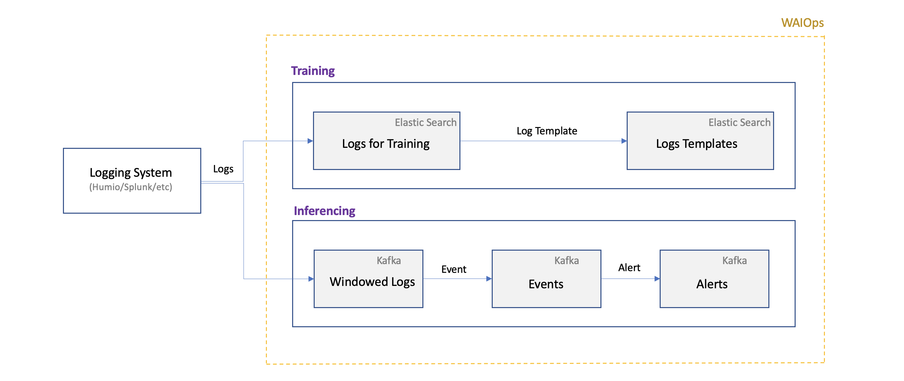
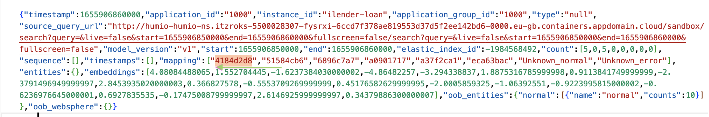

# Log Anomaly detection Data flow in IBM Cloud Pak for Watson AIOps

This document explains about how the incoming logs are stored/converted in various stages of the log anomaly detection process in Watson AIOps. 
 


## 1. Logging system

Logs are shipped from application environment to the logging system such as Splunk, Humio and etc through the Data Shippers like FluentD, Logstash, Elastic Beats and etc.

## 2. Log Mapping

For each logging system there is a mapping available in WAIOps.

### Humio mapping

Here is the mapping for humio.
- The humio field `@rawstring` is mapped to `message_field` in WAIOps for further processing.
- The humio field `kubernetes container name` is mapped to `log entity types` in WAIOps


The below picture shows, `@rawstring` and `kubernetes container name` columns in the humio log


Lets take the below log line from humio for further explanation.
```
Info : Credit Score updated for loan  : 53192
```

### Splunk mapping

Here is the mapping for Splunk.
- The humio field `_raw` is mapped to `message_field` in WAIOps for further processing.
- The humio field `source` is mapped to `log entity types` in WAIOps


## 3. Training

#### Pulling Logs

During training logs are pulled from logging system (humio, etc) and kept in elastic search.

The logs are stored in elastic search as below. It shows the data for the above selected log line in humio.


#### Log Templates

The pulled in logs are parsed and converted into log templates and stored in elastic search.

The log templates are stored in elastic search as below. It shows the log template for above selected log line in humio


## 4. Inferencing

During the inferencing mode the logs are pulled from the logging system (humio, etc), parsed and compared with the existing log templates. If they are not matching with the log template then they will be detected as anomaly. 

#### Incoming logs

All the incoming logs are matched with the log templates and kept in `windowed-logs` Kafka topic as like below.



#### Log Events

When the logs are not matching the log-templates then there will be an entry created in a `input.events` Kafka topic as like below.


#### Log Alert

Based on the existing policy the log events would be created as an alert in `input.alerts` Kafka topic as like below.


