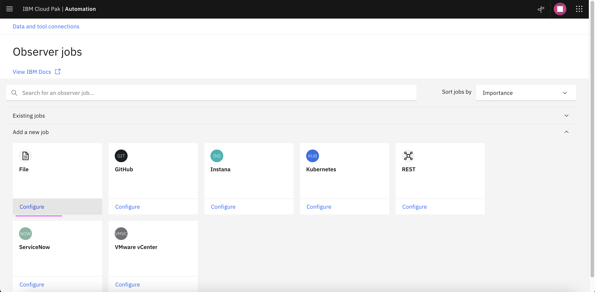
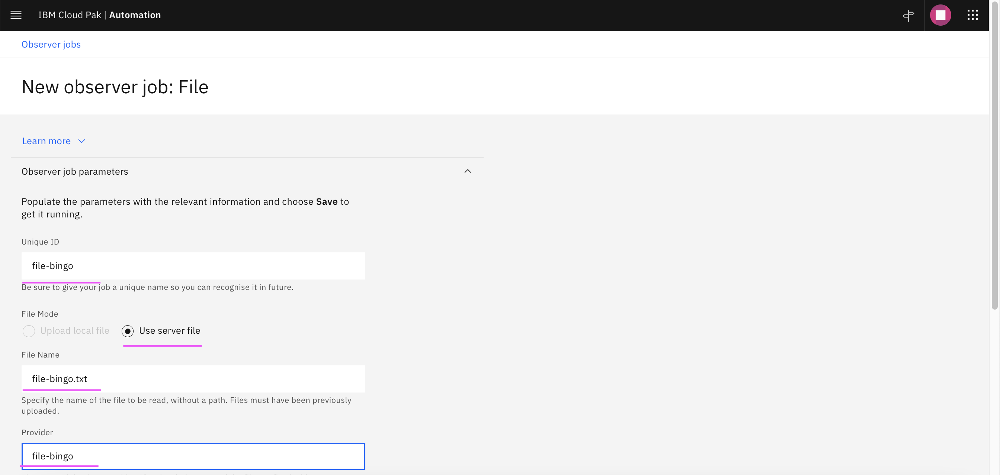

#  Topology File Observer Job

This document explains about how topology file observer job can be created and used in Watson AIOPs.

Using the File Observer functionality, you can write your data to a file in a specific format, upload this data to the topology service, and then visualize this data as a topology view.

The article is based on the the following

RedHat OpenShift 4.8 on IBM Cloud (ROKS)
Watson AIOps 3.4.0

## 1. Login into OCP Cluster

Login into the OCP Cluster where WAIOps AIMgr is installed 

```
oc login ....
```

## 2. Enable File Observer Routes

1. Goto `Installed Operators > asm operators > ASM Details > yaml `

2. Enter `global.enableAllRoutes: true` under `helmValuesASM:` as like below


It should enable a file observer routes in few seconds.


## 3. Create File Observer Job called bingo

1.  Goto `Data and tool connections > Category > Topology `

2. Click on the link `configure, schedule, and manage other observer jobs`


3. Click on the link `Add new job`


4. Click on the link `Configure` under `File`



5. Enter the higlighted values

- Unique Id (job id) : file-bingo
- File Name : file-bingo.txt
- Provider : file-bingo

The same values to be given while uploading the topology file.




## 4. Retrieve the config details

Run the below script to get the config details in `00-config2.sh`. This file is automatcially updated by the script.

```
cd files
sh 01-print-topology-url-usr-pwd.sh
```

### 5. Upload the bingo file

Run the below script to upload bingo files. Here we are uploading the topology file [./files/data/file-bingo.txt](./files/data/file-bingo.txt)

```
cd files
sh 21-upload-bingo.sh
```

The output could be like this.

```
Jeyas-MacBook-Pro:files jeyagandhi$ sh 21-upload-bingo.sh
  started ..... Fri Jul 15 00:08:14 IST 2022
Upload file .....
New File to upload ----> ./data/file-bingo.txt
```

### 6. View Topology

1. Click on  `Run` under `file-bingo` tile. To run the job for the first time.


2.  Goto `Resource Management > Resources `

3.  Enter `bingo` in the search box and press enter button.


The bingo related resources are displayed.

4. Click on any of the resources listed and see the topology like this.


### 7. Update Topology

1. Modify the topology file [./files/data/file-bingo.txt](./files/data/file-bingo.txt)

ex: Change the `bingo-details-v1` into `bingo-details-v5`

2. Upload the modified bingo file

Run the below script to upload the updated bingo files. Here we are uploading the topology file [./files/data/file-bingo.txt](./files/data/file-bingo.txt)

```
cd files
sh 22-upload-bingo-update.sh
```

The output could be like this.

```
Jeyas-MacBook-Pro:files jeyagandhi$ sh 22-upload-bingo-update.sh
  started ..... Fri Jul 15 00:14:08 IST 2022
Upload file .....
Existing File to upload ----> ./data/file-bingo.txt
["Updated successfully"]Jeyas-MacBook-Pro:files jeyagandhi$
```

3. Wait for 2 minutes. The uploaded file should have been observed by the file observer.

If you search for bingo instead of `bingo-details-v1` the `bingo-details-v5` would be displayed.


## References

#### IBM Doc
https://www.ibm.com/docs/en/cloud-paks/cp-waiops/3.4.0?topic=jobs-file-observer

#### Sample files
https://github.com/IBM/cp4waiops-samples/blob/main/file-observer-files/sample-ibmcloud.txt

https://github.com/IBM/cp4waiops-samples/blob/main/file-observer-files/sample-sock-shop.txt

