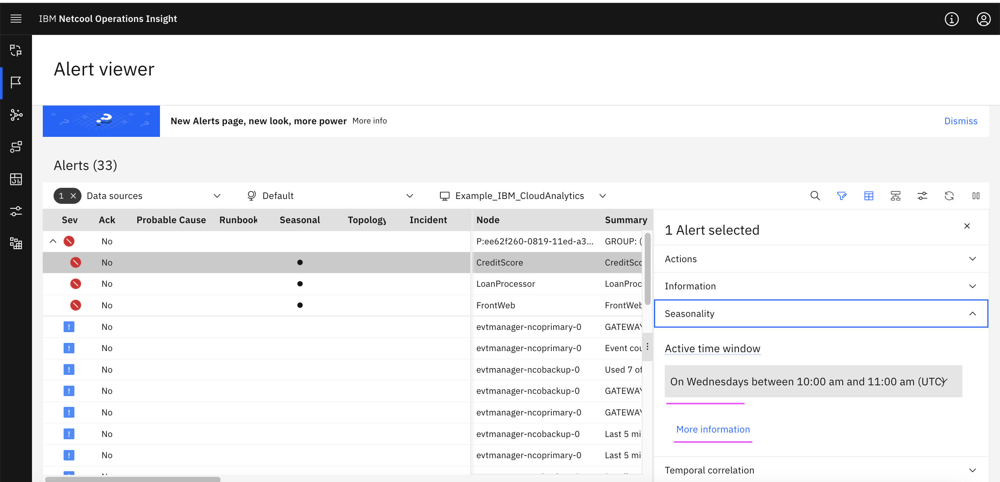
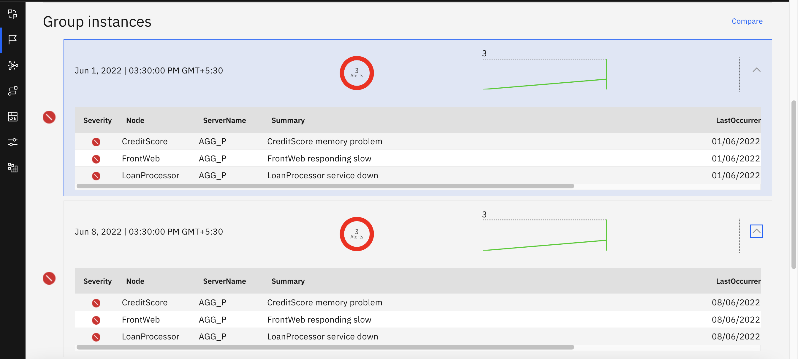

# Viewing Seasonal and Temporal Event Grouping in detail

This documents shows Seasonal and Temporal Event Grouping details.

## 1. Events / Alerts

The below picture shows that a group contains 3 alerts.

Expand the group. It shows the 3 alerts inside the group.

### Seasonal Events

1. Click on the `creditscore` event 

2. Click on the `Seasonality` menu.

It shows `On Wednesdays between 10:00 am and 11:00 am (UTC)`. It means that these occures every wednesday between 10 to 11 am.

3. Click on the `More Information` menu. 

The seasonality details are displayed.

### Temporal Events

1. Click on the `creditscore` event 

2. Click on the `Temporal` menu.

It shows temporal details.

3. Click on the `More Information` menu. 

It shows that all the 3 events are occured together all the time.

Click on the open icon to open the events

It shows the grouped events.

### Correlation Informations

The correlation information shows the `Temporal` grouping flag.

## 2. Policies

The Policies get created based on the training. It contains both `Temporal` and `Seasonal`.

### Temporal 

1. Click on the `Policy Details` in the Temporal policy.

It shows the  `Temporal` grouping.

### Sessonal 

1. Click on the `Policy Details` in the Seasonal policy.

It shows the  `Seasonality` grouping.

